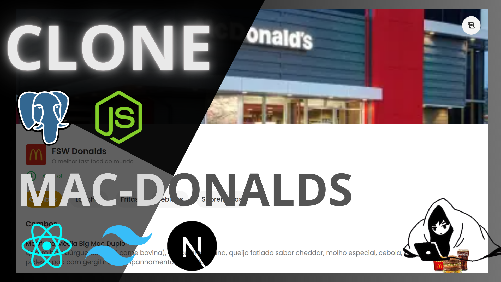
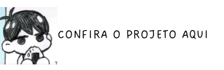

<h1 align="left">🍔 Clone do McDonald's com PERN + Prisma ✨</h1>

<div align="center">
    <a href="https://mac-donalds-copia.vercel.app/fsw-donalds" target="_blank"> 
         
    </a> 
</div>

<div align="center">
    <a href="https://mac-donalds-copia.vercel.app/fsw-donalds" target="_blank"> 
         
    </a> 
</div>

<p align="left">
  <b>Um clone do McDonald's construído com foco em escalabilidade, performance e boas práticas, utilizando as tecnologias mais modernas do ecossistema web.</b>
</p>

---

## 🚀 Tecnologias utilizadas

- 🗄 **PostgreSQL** → Banco de dados relacional  
- ⚙️ **Node.js + Express** → Backend robusto e escalável  
- ⚡ **Prisma ORM** → Mapeamento de dados moderno e tipado  
- ⚛️ **React + Next.js** → Frontend rápido, SSR/SSG e rotas otimizadas  
- 🎨 **TailwindCSS** → Estilização moderna e responsiva  
- 🔐 **Boas práticas** → Tratamento de erros, segurança e organização de código  

<div align="right">
  
  
  
  
  
  
  
  
  
  
  
</div>

---

## ⚙️ Configuração do ambiente

Crie um arquivo `.env` na raiz do projeto com as seguintes variáveis:

```bash
DATABASE_URL=...

NEXT_PUBLIC_API_URL=...
PORT=3000
```

# ▶️ Como rodar o projeto
### 🔹 Backend (API)
Na raiz do projeto, rode:

```bash
npm install
npx prisma migrate dev
```
A API estará disponível em: http://localhost:3000

# 🔹 Frontend

```bash
npm run dev
```

O frontend estará disponível em: http://localhost:3000 (Next.js já usa essa porta por padrão)

# 📂 Estrutura do projeto
├── prisma/          # Código da API (Node.js + Express + Prisma) </br>
├── public/         # Aplicação cliente (React + Next.js + TailwindCSS) </br>
├── src/           # Schemas e migrations do Prisma </br>
├── preview-for-project.png     # Segue-se o resto de arquivos necessários no Next.js </br>
├── .env.example      # Exemplo de variáveis de ambiente </br>
└── README.md         <- Você está aqui 😁

# ✅ Funcionalidades

- 🍟 Menu interativo com produtos estilo McDonald's
- 🛒 Carrinho de compras dinâmico
- 💳 Simulação de checkout
- 📦 Integração entre frontend e backend
- 🔍 Persistência de dados em PostgreSQL via Prisma

# 📜 Licença
Este projeto é open-source sob a licença MIT. </br>
Sinta-se à vontade para usar, modificar e contribuir! 🚀

# 🐱‍💻 Autor
Feito com 💛 por João Enrique
<div align="right"> 
    <a href="https://www.linkedin.com/in/joao-enrique-dev/" target="_blank"> 
         
    </a> 
    <a href="https://www.youtube.com/@joaocodedev" target="_blank"> 
         
    </a> 
    <a href="https://jedev1.itch.io/" target="_blank"> 
         
    </a> 
    <a href="https://www.instagram.com/joao__dev/" target="_blank"> 
         
    </a> 
    <a href="https://www.tiktok.com/@joao__code" target="_blank"> 
     
    </a> 
</div>