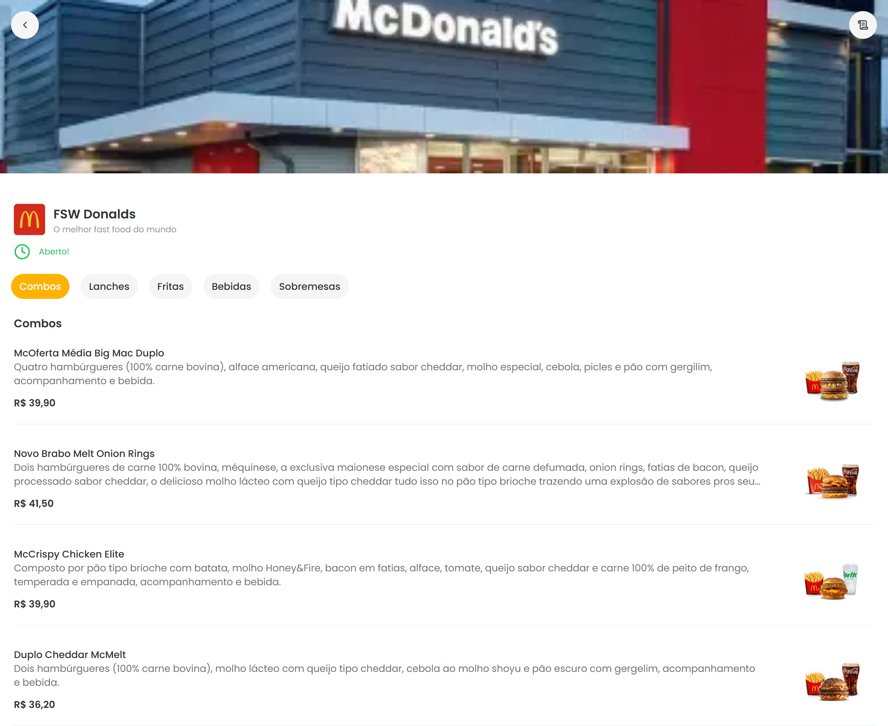

<h1 align="center">🍔 Cópia do Mac-Donalds 🍔</h1>

  

<h4 align="center">
  <a href="https://mac-donalds-copia.vercel.app/fsw-donalds" target="_blank">
    Confira o projeto aqui
  </a>
</h4>

---

## 🔖 Sobre o projeto

Este é um projeto pessoal onde criei uma **cópia do aplicativo do famoso restaurante Mac-Donalds**, com foco em layout moderno, responsivo e funcional. O objetivo principal foi praticar o uso de tecnologias modernas de front-end e back-end, além da integração com banco de dados.

---

## 💻 Tecnologias utilizadas

  
  
  
  
  
  
  
  
  
  
  

---

## 🎯 Principais funcionalidades

- **Rotas dinâmicas**: Navegação entre páginas usando o sistema de rotas do Next.js.  
- **Design moderno e responsivo**: Layout desenvolvido com Tailwind CSS e Shadcn.  
- **Banco de dados**: Implementação com Prisma, MySQL e Neon, otimizando consultas e persistência de dados.  
- **Componentização e otimização**: Uso de React e Next.js para criar componentes reutilizáveis e organizar layouts de forma eficiente.

---
